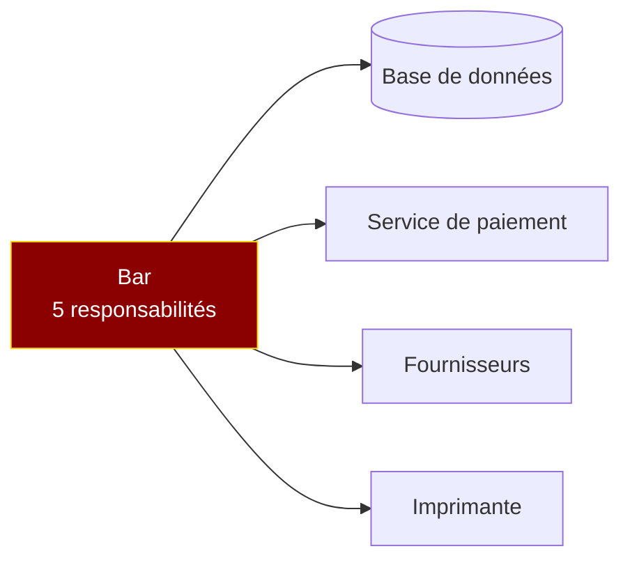
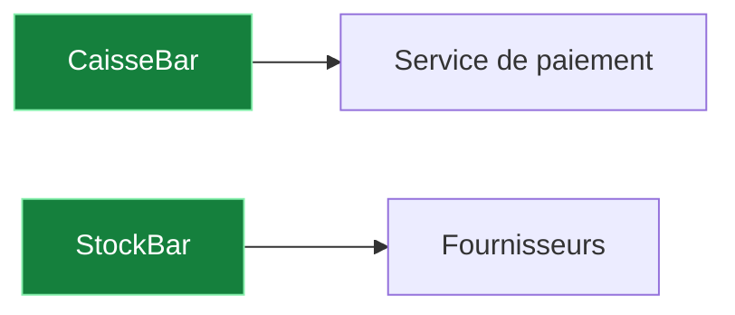

Dans l'article précédent sur [le couplage](/blog/couplage-pourquoi-modifier-a-casse-b/), on a vu comment les dépendances entre composants rigidifient un système. Aujourd'hui, on s'intéresse à l'autre face de la pièce : ce qui se passe *à l'intérieur* d'un composant.

## Définition

La cohésion mesure à quel point les éléments d'un composant (méthodes, attributs) sont liés entre eux et contribuent à un même objectif. Une forte cohésion signifie que **tout ce qui est dans un composant a une raison d'y être**.

L'objectif : que chaque classe, chaque module ait une **responsabilité claire et unique**.

## Les 7 niveaux de cohésion

Selon Larman, il existe sept niveaux de cohésion, du plus faible au plus fort :

### 1. Accidentelle

Les éléments sont regroupés sans raison logique.

```csharp
public class Utils
{
    public static string FormatDate(DateTime date) { /* ... */ }
    public static decimal CalculateTax(decimal amount) { /* ... */ }
    public static void SendEmail(string to, string body) { /* ... */ }
}
```

La classe `Utils`, `Helpers`, `Common` : le tiroir fourre-tout où finit tout ce qu'on ne sait pas ranger. Formater une date, calculer une taxe et envoyer un email n'ont aucun lien entre eux.

### 2. Logique

Les éléments sont regroupés par catégorie, mais ne travaillent pas ensemble.

```csharp
public class Validators
{
    public bool ValidateEmail(string email) { /* ... */ }
    public bool ValidatePhone(string phone) { /* ... */ }
    public bool ValidatePostalCode(string code) { /* ... */ }
}
```

Ils "valident" tous quelque chose, mais n'ont rien en commun au-delà de ça. Chaque méthode travaille sur des données différentes, avec des règles différentes.

### 3. Temporelle

Les éléments sont regroupés parce qu'ils s'exécutent au même moment.

```csharp
public class AppStartup
{
    public void Initialize()
    {
        LoadConfig();
        ConnectToDatabase();
        WarmUpCache();
        StartBackgroundJobs();
    }
}
```

Ces opérations n'ont rien en commun, sauf qu'elles se lancent toutes au démarrage de l'application.

### 4. Procédurale

Les éléments s'exécutent dans un ordre précis mais sur des données différentes.

### 5. Communicationnelle

Les éléments manipulent le même ensemble de données.

### 6. Séquentielle

Les éléments manipulent les mêmes données dans un ordre précis — la sortie de l'un est l'entrée de l'autre.

### 7. Fonctionnelle

Le niveau le plus fort. Le composant est dédié à **une seule et unique tâche**.

```csharp
public class VatCalculator
{
    private readonly decimal _rate;

    public VatCalculator(decimal rate) => _rate = rate;

    public decimal Calculate(decimal amount) => amount * _rate;
    public decimal AddVat(decimal amount) => amount + Calculate(amount);
    public decimal RemoveVat(decimal amountWithVat) => amountWithVat / (1 + _rate);
}
```

Tout dans cette classe sert un seul objectif : calculer la TVA. Chaque méthode utilise le même attribut `_rate`. C'est la cohésion fonctionnelle.

## Exemple concret : le bar

Imaginons une classe qui gère un bar :

```csharp
// ❌ Faible cohésion : la classe fait tout
public class Bar
{
    public void GérerCommandes() { /* ... */ }
    public void Facturer() { /* ... */ }
    public void EncaisserClients() { /* ... */ }
    public void RemplirStocks() { /* ... */ }
    public void CommanderProduits() { /* ... */ }
}
```

Cette classe a cinq responsabilités distinctes. Modifier la gestion des stocks risque de casser la facturation. Tester l'encaissement nécessite de tout instancier.

En séparant par responsabilité :

```csharp
// ✅ Forte cohésion : chaque classe a un rôle clair
public class CaisseBar
{
    public void Facturer() { /* ... */ }
    public void EncaisserClients() { /* ... */ }
}

public class StockBar
{
    public void RemplirStocks() { /* ... */ }
    public void CommanderProduits() { /* ... */ }
}
```

Chaque classe a une seule raison de changer. On peut tester le stock sans se soucier de la caisse.

## Le lien avec le couplage

Cohésion et couplage sont inversement corrélés :

- **Faible cohésion → fort couplage** : quand une classe fait trop de choses, elle a besoin de beaucoup de dépendances pour y arriver
- **Forte cohésion → faible couplage** : quand une classe fait une seule chose, elle a besoin de peu de dépendances



La classe `Bar` a besoin de quatre dépendances parce qu'elle fait tout. En la découpant :



Chaque classe n'a qu'une ou deux dépendances. Le couplage est naturellement faible parce que la cohésion est forte.

## Comment détecter une faible cohésion

Quelques signaux d'alerte :

- La classe a un nom vague (`Manager`, `Handler`, `Utils`, `Service`)
- Les méthodes de la classe ne partagent pas les mêmes attributs
- Le fichier fait plus de 500 lignes et couvre plusieurs sujets
- Vous hésitez sur l'endroit où ajouter une nouvelle fonctionnalité

## En résumé

| Niveau | Type | Exemple |
|---|---|---|
| 1 | Accidentelle | Classe `Utils` fourre-tout |
| 2 | Logique | Classe `Validators` par catégorie |
| 3 | Temporelle | Classe `AppStartup` par moment |
| 4 | Procédurale | Méthodes dans un ordre fixe |
| 5 | Communicationnelle | Mêmes données manipulées |
| 6 | Séquentielle | Sortie de l'un = entrée de l'autre |
| 7 | Fonctionnelle | Une seule tâche (`VatCalculator`) |

La cohésion est le complément du couplage. Ensemble, ils forment la règle d'or de la conception logicielle :

> **Couplage faible, cohésion forte.**

Avant d'ajouter une méthode à une classe, posez-vous la question : **est-ce que cette méthode a sa place ici ?** Si vous hésitez, c'est probablement qu'il faut créer une nouvelle classe.

---

*Cet article est issu d'un séminaire Clean Code donné lors d'un [Bretzel Craft](https://www.meetup.com/software-crafters-strasbourg/). Voir aussi : [Le couplage](/blog/couplage-pourquoi-modifier-a-casse-b/), [Dependency Inversion](/blog/dependency-inversion-decouplage-base-de-donnees/), [Tell, Don't Ask](/blog/tell-dont-ask-encapsulation-objet/). Disponible en [Brown Bag Lunch](/presentations/) dans vos locaux.*
