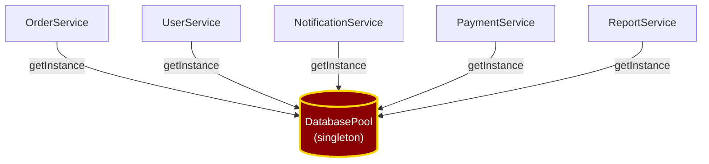

## Le concept le plus sous-estimé du développement

Quand on parle de qualité de code, on pense souvent aux tests, aux design patterns, au clean code. Mais il y a un concept plus fondamental que tous les autres : le **couplage**.

Le couplage entre deux composants mesure le volume d'informations qu'ils échangent. Plus ils échangent, plus ils sont couplés. Plus ils sont couplés, **plus modifier l'un implique de modifier l'autre**.

On parle de couplage **fort** (ou serré) quand deux composants échangent beaucoup de données. Et de couplage **faible** quand ils sont indépendants ou n'échangent qu'un minimum d'information.

## Les 7 niveaux de couplage

Selon Pressman, il existe sept niveaux de couplage, du plus faible au plus fort. Les connaître permet de diagnostiquer la santé d'une codebase.

### 1. Sans couplage

Pas d'échange d'information. Les composants sont totalement indépendants.

```csharp
// Deux services indépendants
public class EmailService { /* ... */ }
public class PdfGenerator { /* ... */ }
// Aucun ne connaît l'existence de l'autre
```

### 2. Par données

Les composants échangent via des paramètres de type simple (nombre, chaîne, booléen).

```csharp
public class PriceCalculator
{
    public decimal Calculate(decimal unitPrice, int quantity)
        => unitPrice * quantity;
}
```

C'est le couplage le plus sain : chaque composant ne connaît que les données dont il a besoin, sous leur forme la plus simple.

C'est d'ailleurs celui qui est utilisé pour la communication entre un front-end et un back-end, ou entre des applications qui n'utilisent pas le même langage de programmation.

### 3. Par paquet

Les composants échangent des objets ou structures composées.

Le couplage est légèrement plus fort : les composants doivent connaître la structure de ces objets pour les utiliser.

```csharp
public class OrderService
{
    public void Process(Order order)
    {
        // Reçoit un objet complet — connaît la structure de Order
        var total = order.Lines.Sum(l => l.Price * l.Quantity);
    }
}
```

La conséquence : si la structure de `Order` change, tous les consommateurs doivent s'adapter.


### 4. Par contrôle

Un composant contrôle le comportement d'un autre via un drapeau ou un paramètre de type "mode".

```csharp
public class ReportGenerator
{
    public string Generate(Order order, bool detailed)
    {
        if (detailed)
            return GenerateDetailedReport(order);
        else
            return GenerateSummaryReport(order);
    }
}
```

Le composant appelant décide *comment* l'autre doit travailler. C'est un signal qu'il en sait trop sur son fonctionnement interne.

### 5. Externe

Les composants communiquent via un moyen externe : fichier partagé, pipeline, API tierce.

```csharp
// Service A écrit dans un fichier
File.WriteAllText("/shared/data.json", json);

// Service B lit le même fichier
var data = File.ReadAllText("/shared/data.json");
```

Le couplage est implicite et fragile : rien dans le code ne documente cette dépendance.

Ce couplage peut être assez vicieux, en particulier quand ce sont des équipes séparées qui maintiennent les composants. 

Les bugs liés à ce type de couplage sont souvent difficiles à diagnostiquer : il n'y a aucune analyse statique possible, et on n'a pas toujours la possibilité d'instancier un environnement complet dans des tests auto ou une pipeline de CI/CD. 


### 6. Commun (global)

Les composants partagent des variables globales ou un état commun.

```csharp
public static class AppState
{
    public static User CurrentUser { get; set; }
    public static string ConnectionString { get; set; }
}

// N'importe quel composant peut lire et modifier cet état
public class OrderService
{
    public void Process()
    {
        var user = AppState.CurrentUser; // dépendance cachée
    }
}
```

Le cas le plus courant de ce couplage : **le singleton**. `DatabasePool.getInstance()`, `SessionManager.getInstance()`, `ConfigurationManager.getInstance()`... Chaque appel crée une dépendance invisible vers un état global partagé.

```csharp
public class OrderService
{
    public void Process(int orderId)
    {
        var db = DatabasePool.getInstance(); // couplage caché
        var session = SessionManager.getInstance(); // encore un
        // ...
    }
}
```

Le problème devient évident quand on visualise les dépendances :



**Chaque service de la codebase est couplé au singleton.** Si la connexion change, si le pool doit être configuré différemment, si on veut tester un service isolément — tout est impacté. Le singleton est un état global déguisé en "bonne pratique".

Chaque composant dépend de l'état global sans que cette dépendance soit visible dans sa signature. Les bugs deviennent imprévisibles.

Ici j'ai choisi un exemple de singleton, mais le même problème se pose avec n'importe quelle variable globale partagée entre plusieurs composants.

Un autre exemple qu'on retrouve souvent sur les projets, c'est la classe de configuration : `AppSettings`, `ConfigManager`, `EnvironmentVariables`... Toutes ces classes sont des états globaux partagés, et chaque composant qui les utilise est implicitement couplé à elles.

Ou encore, la brique d'authentification et de gestion des permissions : `AuthService`, `PermissionManager`, `UserContext`... Chaque composant qui a besoin de vérifier les permissions ou d'authentifier un utilisateur est implicitement couplé à ce service, même si ce n'est pas visible dans sa signature.

### 7. Par contenu (interne)

Un composant lit ou écrit directement dans les données internes d'un autre.

```csharp
public class OrderService
{
    public void ForceDiscount(PriceCalculator calculator)
    {
        // Accès direct aux champs internes via réflexion
        var field = typeof(PriceCalculator)
            .GetField("_discountRate", BindingFlags.NonPublic | BindingFlags.Instance);
        field.SetValue(calculator, 0.5m);
    }
}
```

C'est le niveau le plus fort : les composants n'ont plus aucune frontière. Toute modification est un risque.

## Les conséquences d'un couplage fort

Plus le couplage est fort, plus :

- **Modifier un composant entraîne la modification des autres** — l'effet domino
- **La structure du programme est rigide** — chaque évolution coûte cher
- **L'estimation est impossible** — on ne peut pas prédire l'étendue des modifications nécessaires
- **Les tests sont difficiles** — impossible de tester un composant isolément

La première victime du couplage fort, c'est le planning.

## Comment détecter un couplage trop fort

Quelques signaux d'alerte :

- Une classe importe des dizaines de packages différents (DB, HTTP, utils, logging...)
- Les classes métier instancient directement des classes techniques
- Modifier un module déclenche des effets de bord dans des modules éloignés
- Impossible de tester un composant sans monter toute l'infrastructure

## La solution

Pour réduire le couplage, on met en place des **standards de communication** entre les composants. Les échanges doivent imposer le moins de contraintes possibles aux composants impliqués.

Concrètement, cela passe par :

- **Des abstractions** : dépendre d'interfaces plutôt que d'implémentations concrètes ([Dependency Inversion](/blog/dependency-inversion-decouplage-base-de-donnees/))
- **L'encapsulation** : laisser les objets gérer leur propre état ([Tell, Don't Ask](/blog/tell-dont-ask-encapsulation-objet/))
- **L'injection de dépendances** : ne pas instancier ses dépendances, les recevoir
- **Des contrats minimaux** : n'exposer que le strict nécessaire

## En résumé

| Niveau | Type | Risque |
|---|---|---|
| 1 | Sans couplage | Aucun |
| 2 | Par données | Faible |
| 3 | Par paquet | Modéré |
| 4 | Par contrôle | Élevé |
| 5 | Externe | Élevé (et invisible) |
| 6 | Commun (global) | Très élevé |
| 7 | Par contenu | Maximal |

Le couplage n'est pas un ennemi à éliminer — un système sans aucun couplage ne fait rien. L'objectif est de le **maîtriser** : garder le couplage au niveau le plus faible possible, et rendre les dépendances explicites plutôt que cachées.

Demain, on parlera de l'autre face de la pièce : la [cohésion](/blog/cohesion-quand-une-classe-fait-trop-de-choses/), le principe qui guide la structuration *interne* des composants.

---

*Cet article est issu d'un séminaire Clean Code donné lors d'un [Bretzel Craft](https://www.meetup.com/software-crafters-strasbourg/). Pour approfondir avec des exemples concrets, consultez mes autres articles sur le [blog](/blog/) ou invitez-moi pour un [Brown Bag Lunch](/presentations/) dans vos locaux.*
