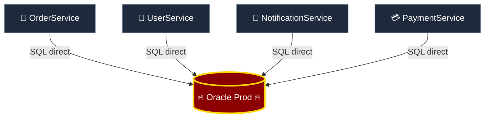
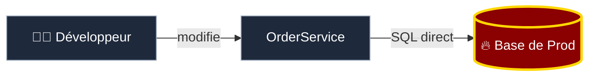
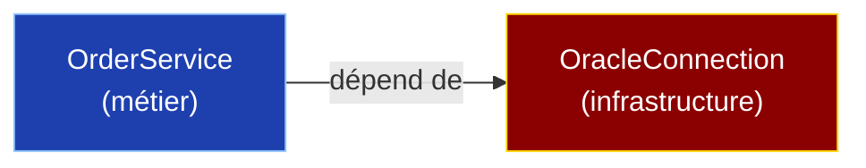
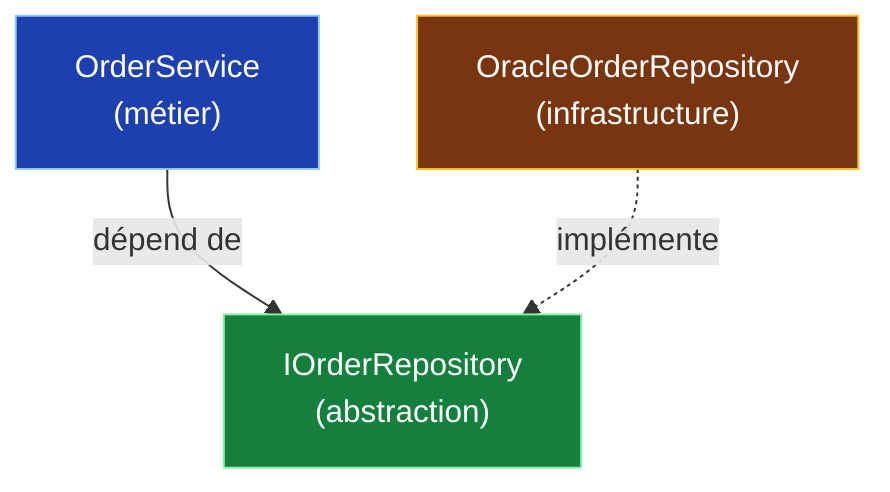
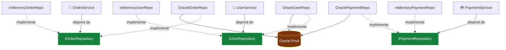
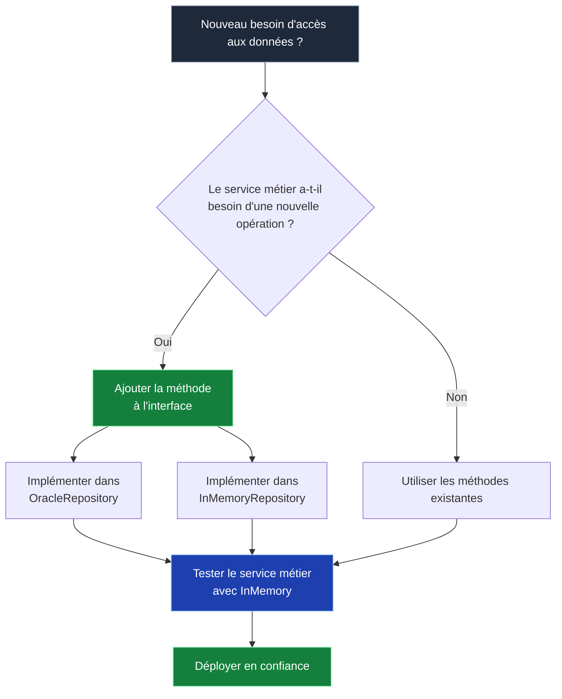

## Le piège : des services soudés à la base de données

Voici un pattern qu'on retrouve dans beaucoup de codebases :

```csharp
public class OrderService
{
    public Order GetOrder(int id)
    {
        var conn = new OracleConnection(
            "Data Source=PROD_DB;User Id=admin;Password=...");
        var cmd = new OracleCommand(
            "SELECT * FROM Orders WHERE Id = @id", conn);
        cmd.Parameters.AddWithValue("@id", id);

        conn.Open();
        var reader = cmd.ExecuteReader();
        // ... mapping manuel des colonnes
    }
}
```

Le service métier instancie directement une connexion Oracle, écrit du SQL brut, et mappe les résultats à la main.

Problème ? Ce pattern se retrouve **dans chaque service** :



**Chaque service connaît Oracle.** Chaque service sait construire une connexion, écrire du SQL, et parser des résultats. La base de données est partout dans le code.

## Les conséquences concrètes

Ce couplage a des effets en cascade qui paralysent progressivement l'équipe :

### Impossible de tester sans la base de prod

```csharp
// Pour tester OrderService, il faut :
// 1. Une instance Oracle qui tourne
// 2. Des données cohérentes dans toutes les tables
// 3. Un réseau qui atteint la base
// Résultat : les tests ne tournent qu'en CI, et encore...
[TestMethod]
public void GetOrder_ReturnsOrder()
{
    var service = new OrderService(); // 💥 besoin d'Oracle
    var order = service.GetOrder(42); // 💥 besoin de données en base
    Assert.IsNotNull(order);
}
```

### Impossible de changer de base de données

Le jour où l'entreprise veut migrer d'Oracle vers PostgreSQL, chaque service doit être réécrit. Les requêtes SQL sont différentes, les types sont différents, les connexions sont différentes.

### Impossible de refactorer sans risquer la prod

Toucher un service, c'est toucher du SQL qui tape sur la base de production. Un oubli dans une clause `WHERE`, et c'est l'incident.



Pas de filet de sécurité. Pas d'abstraction entre le code et la production.

## Le Dependency Inversion Principle

Robert C. Martin l'a formulé ainsi :

> *"Les modules de haut niveau ne doivent pas dépendre des modules de bas niveau. Les deux doivent dépendre d'abstractions."*

Concrètement : `OrderService` (haut niveau, logique métier) ne devrait pas dépendre d'`OracleConnection` (bas niveau, infrastructure). Les deux devraient dépendre d'une **interface**.

## Avant / Après : l'inversion en action

### Avant : couplage direct

```csharp
// OrderService DÉPEND de OracleConnection
public class OrderService
{
    public Order GetOrder(int id)
    {
        var conn = new OracleConnection("Data Source=PROD_DB;...");
        var cmd = new OracleCommand(
            "SELECT * FROM Orders WHERE Id = @id", conn);
        // ... Oracle partout
    }

    public void PlaceOrder(Order order)
    {
        var conn = new OracleConnection("Data Source=PROD_DB;...");
        var cmd = new OracleCommand(
            "INSERT INTO Orders ...", conn);
        // ... encore Oracle
    }
}
```

Le sens de la dépendance va du métier vers l'infrastructure :



### Après : dépendance inversée

On introduit une interface que le service métier définit selon **ses** besoins :

```csharp
// L'interface est définie par le code métier
public interface IOrderRepository
{
    Order GetById(int id);
    void Save(Order order);
    IReadOnlyList<Order> GetByCustomer(int customerId);
}
```

Le service métier ne dépend que de cette interface :

```csharp
public class OrderService
{
    private readonly IOrderRepository _repository;

    public OrderService(IOrderRepository repository)
        => _repository = repository;

    public Order GetOrder(int id)
        => _repository.GetById(id);

    public void PlaceOrder(Order order)
    {
        order.Validate();
        _repository.Save(order);
    }
}
```

L'implémentation Oracle est isolée dans une classe d'infrastructure :

```csharp
public class OracleOrderRepository : IOrderRepository
{
    private readonly string _connectionString;

    public OracleOrderRepository(string connectionString)
        => _connectionString = connectionString;

    public Order GetById(int id)
    {
        using var conn = new OracleConnection(_connectionString);
        // SQL Oracle ici, et seulement ici
    }

    public void Save(Order order) { /* ... */ }
    public IReadOnlyList<Order> GetByCustomer(int customerId) { /* ... */ }
}
```

Le sens de la dépendance est **inversé** :



`OrderService` ne sait plus qu'Oracle existe. Il parle à une interface. L'implémentation Oracle est un détail d'infrastructure, interchangeable.

## L'architecture complète

Avec le Dependency Inversion appliqué à tous les services, l'architecture ressemble à ceci :



Les interfaces (en vert) sont le bouclier. Elles protègent le code métier du monde extérieur.

## Ce que ça débloque

### Des tests sans base de données

```csharp
[TestMethod]
public void PlaceOrder_SavesOrderToRepository()
{
    // Arrange - implémentation en mémoire, pas besoin d'Oracle
    var repository = new InMemoryOrderRepository();
    var service = new OrderService(repository);
    var order = new Order { CustomerId = 1, Total = 99.99m };

    // Act
    service.PlaceOrder(order);

    // Assert
    var saved = repository.GetById(order.Id);
    Assert.IsNotNull(saved);
    Assert.AreEqual(99.99m, saved.Total);
}
```

Les tests tournent en millisecondes, sans infrastructure, sur n'importe quelle machine.

### Une migration de base de données indolore

Le jour où il faut migrer vers PostgreSQL :

```csharp
public class PostgresOrderRepository : IOrderRepository
{
    public Order GetById(int id) { /* SQL PostgreSQL */ }
    public void Save(Order order) { /* ... */ }
    public IReadOnlyList<Order> GetByCustomer(int customerId) { /* ... */ }
}
```

**Aucun service métier n'est modifié.** Il faut bien sûr écrire les nouveaux repositories PostgreSQL, mais la configuration de l'injection de dépendances, elle, ne change qu'en une ligne :

```csharp
// Avant
services.AddScoped<IOrderRepository, OracleOrderRepository>();

// Après
services.AddScoped<IOrderRepository, PostgresOrderRepository>();
```

Le passage de l'un à l'autre se fait en une ligne (et en implémentant les nouveaux repositories, bien sûr). Le code métier, lui, ne sait même pas que la base a changé.

*Note : si vos repositories utilisent un ORM comme Entity Framework ou Hibernate, la migration est quasi littéralement une ligne — l'ORM abstrait déjà les différences entre bases de données.*

### Le flux de décision

Voici comment l'architecture guide les choix de l'équipe :



## L'erreur courante : l'interface qui copie la base

Attention à un piège fréquent. Certains créent des interfaces qui calquent la structure de la base de données :

```csharp
// ❌ L'interface expose les détails de la base
public interface IOrderRepository
{
    DataTable ExecuteQuery(string sql);
    int ExecuteNonQuery(string sql);
    DbDataReader GetReader(string tableName);
}
```

Ce n'est **pas** du Dependency Inversion. C'est juste une indirection. L'interface doit être définie selon les besoins du code métier, pas selon la technologie sous-jacente :

```csharp
// ✅ L'interface exprime les besoins métier
public interface IOrderRepository
{
    Order GetById(int id);
    void Save(Order order);
    IReadOnlyList<Order> GetByCustomer(int customerId);
    IReadOnlyList<Order> GetPendingOrders();
}
```

La différence ? La première interface oblige le code métier à écrire du SQL. La seconde le libère de toute connaissance technique.

## En résumé

- Le couplage direct à la base de données **empêche les tests, le refactoring et la migration**
- Le Dependency Inversion Principle place une **abstraction** entre le code métier et l'infrastructure
- L'interface est définie par le code métier, **pas par la base de données**
- Les implémentations (Oracle, PostgreSQL, InMemory) sont **interchangeables**
- Les tests deviennent **rapides, fiables et indépendants** de l'infrastructure

Le principe est simple : votre code métier ne devrait jamais savoir quelle base de données il utilise. Si changer de base se résume à implémenter de nouveaux repositories et modifier une ligne de configuration, vous avez gagné.

---

*Cet article est tiré de ma conférence [Le Seigneur du Legacy](/presentations/seigneur-du-legacy), où le Balrog représente ce couplage profond à la base de production — un danger qui sommeille dans les fondations du code depuis des années. Disponible en [Brown Bag Lunch](/presentations/) dans vos locaux.*
